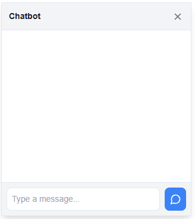
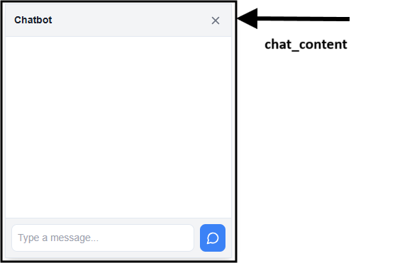

# Overview

A lightweight and customizable chatbot UI powered by the **OpenAI API**. Easily plug it into any app to enable AI-powered conversation.

## OpenAI chatbot

### Qodly Source

| Name        | Type   | Required | Description         |
| ----------- | ------ | -------- | ------------------- |
| QodlySource | String | Yes      | Your openAi api key |

### Custom Css

When customizing the appearance of the chatbot, you have access to the chatbot content class :

